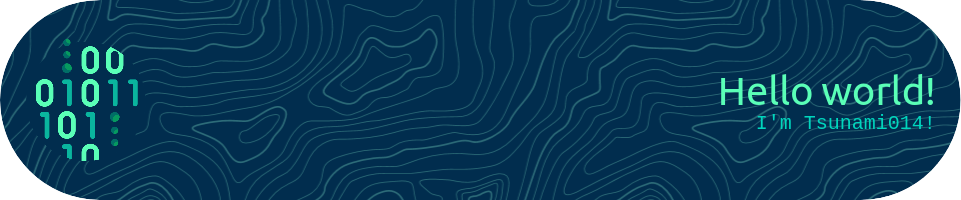

<h3 align="center">
  
</h3>

# 💡 About me
 - I'm currently working on a game engine called [Blaze Sudios](https://github.com/Tsunami014/Blaze-Sudio)
 - I'm **very** good at python
 - I would like to learn more about other languages
 - Go look at my [Codingame profile](https://www.codingame.com/profile/658075e0ba9b9b722ef519d0010b39fc9069326)!

<!--
**Tsunami014/Tsunami014** is a ✨ _special_ ✨ repository because its `README.md` (this file) appears on your GitHub profile.

Here are some ideas to get you started:

- 🔭 I’m currently working on ...
- 🌱 I’m currently learning ...
- 👯 I’m looking to collaborate on ...
- 🤔 I’m looking for help with ...
- 💬 Ask me about ...
- 📫 How to reach me: ...
- 😄 Pronouns: ...
- ⚡ Fun fact: ...
-->
